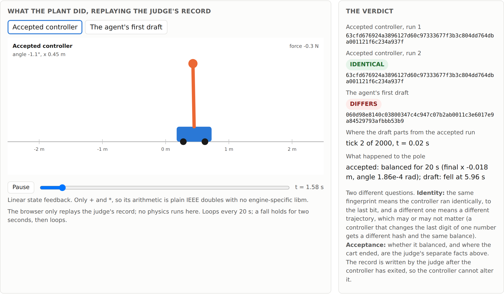
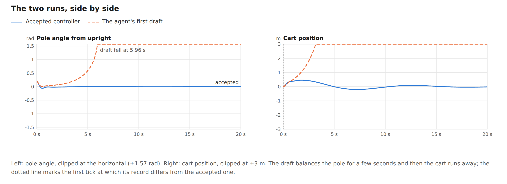
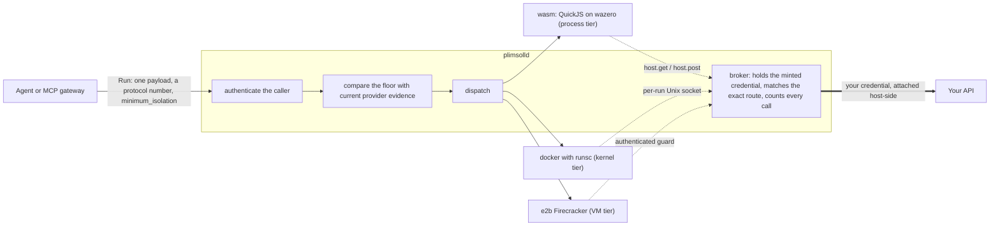

# plimsoll

**A sandbox service for running untrusted, agent-authored code that reports the
isolation boundary each run executed behind, and refuses the run when it is weaker
than the caller demanded.**

[](https://github.com/plimsollmark/plimsoll/actions/workflows/audit.yml)
[](https://github.com/plimsollmark/plimsoll/actions/workflows/gvisor.yml)
[](https://pkg.go.dev/github.com/plimsollmark/plimsoll)
[](go.mod)
[](https://github.com/plimsollmark/plimsoll/releases)
[](LICENSE)

A Plimsoll line is the load limit painted on a ship's hull. It is mandatory, and it
is on the outside where anyone can check it. That is the idea here: the isolation
tier is a value the caller reads, asserts a floor against, and re-checks on the
response, not a sentence in a datasheet.

## See one real run

An agent wrote a controller. A cart-pole, compiled to WebAssembly and baked into the
sandbox image, judged it. The controller was the only file the caller sent, through
the ordinary project API, on the container tier.

[](https://plimsollmark.github.io/plimsoll/examples/oracle/index.html)

A cart-pole is a cart on a rail with a pole hinged on top of it, the standard teaching
problem in control engineering: push the cart left and right to keep the pole upright.
Run the accepted controller twice and the fingerprints of the two trajectories match
to the last bit. The agent's first draft, with two gains of the wrong sign, drops the
pole at 5.96 seconds and fingerprints differently.

[](https://plimsollmark.github.io/plimsoll/examples/oracle/index.html)

**[Open the live run report ↗](https://plimsollmark.github.io/plimsoll/examples/oracle/index.html)**
to replay both runs in the browser, read the controller the agent wrote, and see what
the page deliberately does not claim. Every number on it came from one run you can
reproduce with `make docker-images && go run ./examples/oracle`.

| More to look at | What it is |
|---|---|
| [A controller in C, compiled in the sandbox ↗](https://plimsollmark.github.io/plimsoll/examples/wasm-controller/index.html) | The same judge and cart-pole, with a swing-up controller written in C and compiled to WebAssembly by the run's own first step, so plant and controller are both WebAssembly. The run report replays the swing-up and compares it with the JavaScript version tick by tick: the two differ in two forces, by a few representable doubles, and the fingerprint catches it while the motion stays bit-identical. Source and caveats in [its README](examples/wasm-controller/README.md); reproduce with `make docker-images && go run ./examples/wasm-controller`. |
| [Same run, different sandboxes ↗](https://plimsollmark.github.io/plimsoll/examples/providers/index.html) | The oracle's run on a local container, E2B Firecracker and Docker Cloud Sandboxes: two isolation tiers, two Node versions, one fingerprint, the one the oracle page published. Reproduce with `go run ./examples/providers`. |
| [The efficiency advisor's report ↗](https://plimsollmark.github.io/plimsoll/examples/advisor/report.html) | One measured run, rendered: the same question asked as 13 calls and then as 1, and the finding that names the route to batch on. |
| [Twelve interactive lessons ↗](https://plimsollmark.github.io/plimsoll/trainers/) | The execution model, the providers, the API broker, and integrating with an agent. Static pages: no network calls, no analytics, no third-party scripts. |
| [System topology diagram](docs/architecture/topology.svg) | Request admission, provider boundaries, and brokered API calls, on one page. |

## The two things it does

**It reports the boundary.** Every result carries the isolation tier the run actually
executed behind, and every request can carry a floor. A request below the floor is
refused before dispatch, so `ErrInsufficientIsolation` means no submitted code ran.

```go
res, err := provider.Sandbox.RunJavaScript(ctx, sandbox.Request{
    Code:             "console.log(6 * 7)",
    MinimumIsolation: sandbox.IsolationVM, // ErrInsufficientIsolation means nothing ran
})
// res.Isolation reports the boundary that actually ran.
```

Read the tier as evidence this daemon collected, not as a remote attestation: no
provider here cryptographically attests the runtime implementation underneath it.
What each tier rests on is spelled out in
[docs/isolation-tiers.md](docs/isolation-tiers.md).

**It lets agent-written code use your API without ever receiving your credential,
your base URL, or general network access.** The bearer is minted per run, stays in
Go, and is attached host-side only after the caller and the exact route have been
authorized. Code that ignores the injected client and calls out by hand does not get
further, because the broker rather than the client is what enforces the policy.
See [docs/capability-grants.md](docs/capability-grants.md).

## Run something in one minute

No daemon, no docker, no credentials, no network: this selects the in-process WASM
provider.

```sh
git clone https://github.com/plimsollmark/plimsoll && cd plimsoll
go run ./examples/minimal
```

```
provider   wasm
isolation  process
exit code  0
timed out  false
truncated  stdout=false stderr=false
duration   304ms
stdout     {"Engineering":59000000,"Sales":20300000,"Operations":9800000}
```

That `isolation` line is the run's own evidence, not a claim by the example.
**`process` is not an OS boundary and is not a production posture for hostile code.**
The same snippet runs behind a real kernel boundary once gVisor is installed, and
nothing else about the program changes:

```sh
SANDBOX_PROVIDER=docker SANDBOX_DOCKER_RUNTIME=runsc go run ./examples/minimal
```

With `SANDBOX_PROVIDER` unset, the factory selects the Disabled provider and runs
nothing. Execution is opt-in and cannot be switched on by accident.

**Next:** [docs/getting-started.md](docs/getting-started.md) takes the same pieces in
order on one machine, from an in-process daemon to a kernel-tier one, with a caller
credential, your own client program, and a floor refusing a run before it starts. It
also covers embedding the package instead of running the daemon.

## Where the pieces sit



The guest never holds the credential and never reaches the network directly. A run
with no grant reaches nothing at all.

## Isolation tiers

| Provider | Boundary | Tier reported | Use |
|---|---|---|---|
| `wasm` | QuickJS on wazero, inside `plimsolld` itself | `process` | The inner loop. An engine escape lands in your daemon. |
| `docker` with `runc` | container, sharing the host kernel | `container` | Self-hosting where the kernel boundary is not the threat model. |
| `docker` with `runsc` | gVisor, after a verified preflight | `kernel` | Hostile code, self-hosted. |
| `e2b` | Firecracker microVM | `vm` | Hostile code, on runners off your host. |
| `dockercloud` | Docker Cloud Sandboxes microVM | `vm` | Hostile code, on Docker-managed runners. Implemented against Docker's published API contract; the live suite passed against the real service on 2026-09-24. Requires the account's cloud network policy to default to deny-all, which every run verifies. Host-API grants through the same guard as E2B when `SANDBOX_DOCKERCLOUD_GUARD_URL` is set; unlike E2B, the guest holds its own run's short-lived, guard-only credential, and the one network rule is applied through a Docker call outside its published contract. |
| unset | nothing runs | n/a | The default. |

Every tier is configuration plus provider evidence plus a behavioural startup smoke
test, never runtime attestation. The full evidence chain, and how a caller demands a
floor per request, are in [docs/isolation-tiers.md](docs/isolation-tiers.md).

## Status, plainly

- **Pre-1.0**, single author, no external users yet. Breaking changes land without a
  deprecation path, on purpose.
- **No third-party security audit has ever been performed**, and the author's own
  self-review ledgers are not published either. [SECURITY.md](SECURITY.md) says what
  exists, what it is worth, and what you can check yourself instead.
- **CI runs the gate, in the open, and each check means what it ran.** The
  [audit workflow](.github/workflows/audit.yml) has two jobs. `audit` runs plain
  `make audit` on every push and pull request: build, vet, race tests, lint,
  `buf lint`, a generated-code drift check, and `govulncheck`. `audit-docker` then
  runs `make audit DOCKER=1` with the images prepared, in required mode: a missing
  daemon, a missing image or a skipped test fails the job. A green `audit-docker`
  therefore means the docker suite ran under runc with the shipped seccomp profile
  and proved a read-only root, sized `noexec` writable mounts, and the broker's
  refusals. The [gvisor workflow](.github/workflows/gvisor.yml) runs the same suite
  under runsc, the kernel tier, from the pinned installer. What no check exercises
  is E2B or Docker Cloud Sandboxes: those suites drive live paid services and are
  deliberately never wired to a runner. See [CONTRIBUTING.md](CONTRIBUTING.md).

## Learn how it works

The [interactive lessons](https://plimsollmark.github.io/plimsoll/trainers/) are the
fastest way in if you would rather read than clone. Start with
**[Plain English](https://plimsollmark.github.io/plimsoll/trainers/plain-english.html)**
if you want the idea before the API, or
**[Quick start](https://plimsollmark.github.io/plimsoll/trainers/quick-start.html)**
if you want to run something. They live in [docs/trainers/](docs/trainers/) and work
offline: open any file from a clone in a browser. GitHub shows `.html` files as source
rather than rendering them, which is why the links above point at the published copy.

## Documentation

Each of these answers one question, end to end.

| Document | Answers |
|---|---|
| [docs/getting-started.md](docs/getting-started.md) | How do I build it, embed it, start it as an authenticated service, and watch a floor be refused? |
| [docs/example-programs.md](docs/example-programs.md) | What do the six runnable examples prove, and which should I read first? |
| [docs/isolation-tiers.md](docs/isolation-tiers.md) | What does each tier rest on, and how do I demand one per request? |
| [docs/capability-grants.md](docs/capability-grants.md) | How does agent code call my API without ever holding my credential? |
| [docs/run-results.md](docs/run-results.md) | What comes back, and when is a failure an error rather than a result? |
| [docs/inner-loop-workflow.md](docs/inner-loop-workflow.md) | How do I iterate fast locally without shipping a weak sandbox to production? |
| [docs/efficiency-advisor.md](docs/efficiency-advisor.md) | What does the advisor see, why can its telemetry not carry guest content, and how do I configure what it emits? |
| [docs/hardened-mode.md](docs/hardened-mode.md) | How do I turn the production posture into an enforced startup policy? |
| [docs/dependencies.md](docs/dependencies.md) | What is in the trusted surface, and who checks the checkers? |
| [docs/limitations.md](docs/limitations.md) | What does this deliberately not do? |
| [docs/callers.md](docs/callers.md) | How do I create, rotate and revoke caller credentials? |
| [docs/seccomp.md](docs/seccomp.md) and [docs/gvisor.md](docs/gvisor.md) | What do the syscall filter and the kernel-tier boundary enforce? |
| [docs/guest-dependencies.md](docs/guest-dependencies.md) | How do guest packages get in when a run has no network? |
| [docs/architecture/credential-minting.md](docs/architecture/credential-minting.md) | Where does a per-run credential come from, and where does it stay? |
| [docs/seams.md](docs/seams.md) | Where are the deliberate extension points? |
| [AGENTS.md](AGENTS.md) | The architecture reference: providers, invariants, the full environment list. |

## License

[Apache-2.0](LICENSE).
