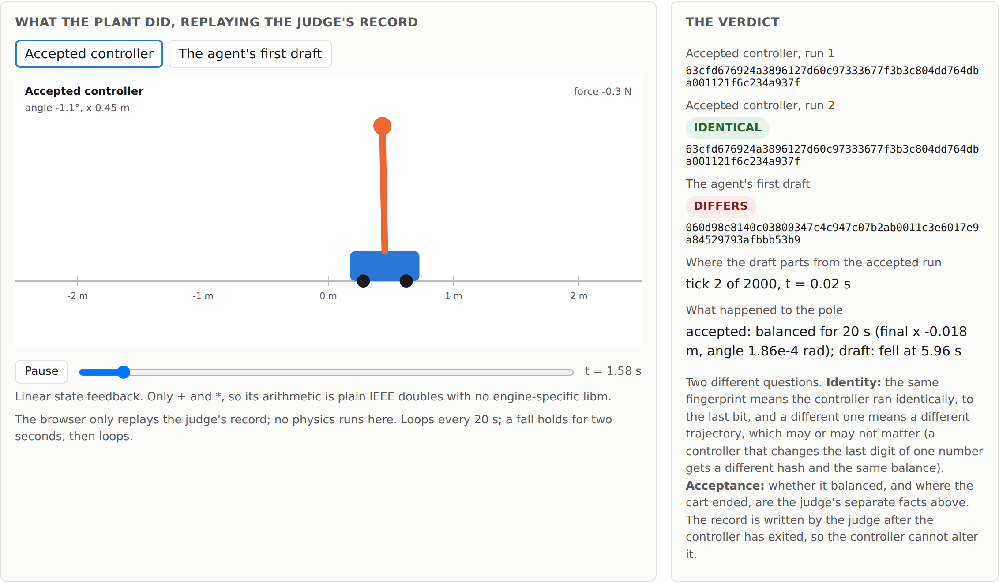
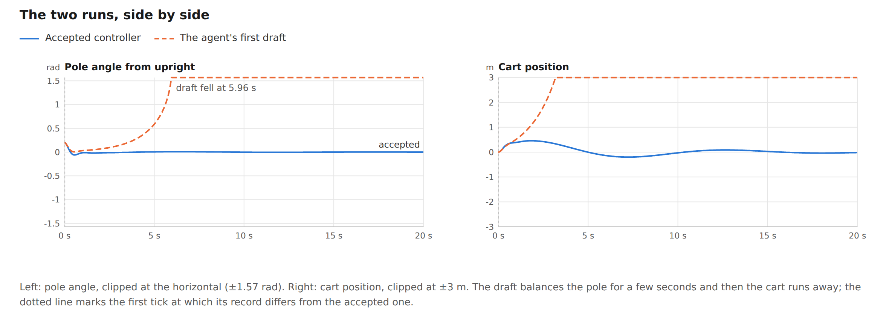
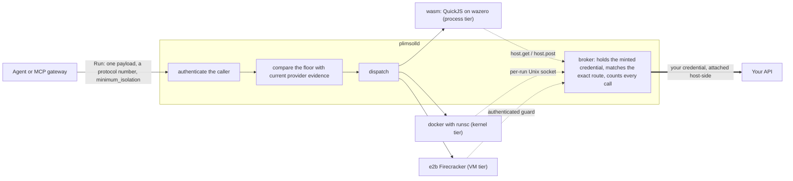

# plimsoll

**plimsoll runs untrusted code, such as code an AI agent wrote, inside a sandbox, and
every result says how strong that sandbox was. A request can demand a minimum strength;
if the sandbox is weaker, nothing runs.**

[](https://github.com/plimsollmark/plimsoll/actions/workflows/audit.yml)
[](https://github.com/plimsollmark/plimsoll/actions/workflows/gvisor.yml)
[](https://pkg.go.dev/github.com/plimsollmark/plimsoll)
[](go.mod)
[](https://github.com/plimsollmark/plimsoll/releases)
[](LICENSE)

The name comes from the <dfn>*Plimsoll line*</dfn>, the load limit painted on the outside
of a ship's hull where anyone can check it. plimsoll does the same for the
<dfn>*isolation tier*</dfn>: how strong the wall around a run is, stated as one of four
levels, weakest first: `process`, `container`, `kernel`, `vm`. The tier is a value on every
result, not a sentence in a datasheet. A request can set a <dfn>*floor*</dfn>, the weakest
tier it will accept, and the official Go client checks the tier again when the result
comes back.

## See one real run

An AI agent wrote a <dfn>*controller*</dfn>: a program that reads a system's state at
every <dfn>*tick*</dfn> (here, one 10 ms step of the simulation) and decides how to push it. plimsoll
ran it against a simulated <dfn>*cart-pole*</dfn>, a cart on a rail with a pole hinged on
top, which the controller keeps upright by pushing the cart left and right. The simulator
is compiled to <dfn>*WebAssembly*</dfn>, a portable bytecode that runs inside a host program,
and built into the sandbox image. The controller was the only file the caller sent, through
the ordinary project API, and it ran at the `container` tier.

[](https://plimsollmark.github.io/plimsoll/examples/oracle/index.html)

The cart-pole is the standard teaching problem in control engineering. The runner, a
program built into the image that runs the controller against the simulator, records
the run's <dfn>*trajectory*</dfn>, every state at every tick, and hashes it into a
<dfn>*fingerprint*</dfn>: a SHA-256 hash, so equal fingerprints mean identical numbers. Run
the accepted controller twice and the two fingerprints match. The agent's first draft had
two gains (multipliers in its formula) with the wrong sign: it drops the pole at 5.96
seconds, and its fingerprint differs.

[](https://plimsollmark.github.io/plimsoll/examples/oracle/index.html)

**[Open the live run report ↗](https://plimsollmark.github.io/plimsoll/examples/oracle/index.html)**
to replay both runs in the browser, read the controller the agent wrote, and see what the
page deliberately does not claim. One execution of the example makes three sandbox runs: the accepted
controller twice and the draft once. Reproduce them with
`make docker-images && go run ./examples/oracle`.

## The two things it does

**It reports the wall.** Every result states the isolation tier the run actually got.
Every request can set a floor, and a request whose floor the daemon cannot meet is refused
before any code runs: `ErrInsufficientIsolation` means nothing ran.

```go
res, err := provider.Sandbox.RunJavaScript(ctx, sandbox.Request{
    Code:             "console.log(6 * 7)",
    MinimumIsolation: sandbox.IsolationVM, // ErrInsufficientIsolation means nothing ran
})
// res.Isolation reports the boundary that actually ran.
```

Every refusal that ran nothing is marked as one, with a reason (`request`, `permission`,
`protocol`, `unsupported`, `isolation`, `environment`, `capacity`). `sandbox.NotDispatchedReason(err)`
reads the mark, whether the <dfn>*provider*</dfn> (the backend that runs the code) is in
your own process or behind the daemon. An error without the mark may have come after the
code started, so it is never safe to retry automatically
([what comes back, and what it means](docs/run-results.md#did-anything-run-the-error-says-so)).

The tier is evidence the daemon collected: its configuration and its own startup checks.
It is not <dfn>*attestation*</dfn>, cryptographic proof from the hardware of what software
is running, and no provider here offers that.
[docs/isolation-tiers.md](docs/isolation-tiers.md) lists what each tier rests on.

**It lets agent-written code call your API without ever holding your credential, your
API's address, or open network access.** A <dfn>*grant*</dfn> gives one run permission to
call listed routes of one API. The code calls through a small client plimsoll puts in the
sandbox, and the <dfn>*broker*</dfn>, the part of plimsoll outside the sandbox that makes
the real call, checks the caller and the exact route, then attaches the credential itself.
The credential is <dfn>*minted*</dfn> per run: plimsoll asks for it once per run, so it can
be a fresh short-lived token, and it never enters the sandbox. Code that skips the client
and calls out by hand gets no further, because the broker, not the client, enforces the
rules. See [docs/capability-grants.md](docs/capability-grants.md).

## Run something in one minute

The example needs no daemon, no docker, no credentials and no network: it uses the `wasm`
provider, which runs JavaScript on <dfn>*QuickJS*</dfn>, a small JavaScript engine
compiled to WebAssembly, inside your own process. Cloning and fetching Go modules do use
the network.

```sh
git clone https://github.com/plimsollmark/plimsoll && cd plimsoll
go run ./examples/minimal
```

```
provider   wasm
isolation  process
exit code  0
timed out  false
truncated  stdout=false stderr=false
duration   304ms
stdout     {"Engineering":59000000,"Sales":20300000,"Operations":9800000}
```

The `isolation` line comes from the run's result, not from the example's own text.
**`process` means there is no operating-system wall at all: do not use it for hostile
code.** The same snippet runs at the `kernel` tier once <dfn>*gVisor*</dfn> is installed.
gVisor is a layer between a container and your machine's kernel that handles the
container's requests to the operating system itself, so the code never talks to your
kernel directly. `sudo ./docker/install-gvisor.sh` installs a <dfn>*pinned*</dfn> gVisor
release (one exact version, changed only by editing this repository) and registers its
runtime, <dfn>*runsc*</dfn>, with docker. Nothing else about the program changes:

```sh
SANDBOX_PROVIDER=docker SANDBOX_DOCKER_RUNTIME=runsc go run ./examples/minimal
```

With `SANDBOX_PROVIDER` unset, plimsoll uses the Disabled provider, which runs nothing, so
code execution is never on by accident.

**Next:** [docs/getting-started.md](docs/getting-started.md) walks through the same pieces
on one machine: start the daemon, create a caller credential, write your own client, watch
a floor refuse a run, then move the daemon from `process` to `kernel` without changing the
client. It also covers embedding the Go package instead of running the daemon.

## Where the pieces sit


```mermaid
flowchart LR
  A["Agent or MCP gateway"] -->|"Run: one payload, a protocol number, minimum_isolation"| AU

  subgraph D["plimsolld"]
    AU["authenticate the caller"] --> FL["compare the floor with current provider evidence"]
    FL --> DI["dispatch"]
    BR["broker: holds the minted credential, matches the exact route, counts every call"]
  end

  DI --> W["wasm: QuickJS on wazero (process tier)"]
  DI --> K["docker with runsc (kernel tier)"]
  DI --> V["e2b Firecracker (VM tier)"]

  W -. "host.get / host.post" .-> BR
  K -. "per-run Unix socket" .-> BR
  V -. "authenticated guard" .-> BR
  BR ==> |"your credential, attached host-side"| API["Your API"]
```

The code inside the sandbox, the <dfn>*guest*</dfn>, never holds the credential and never
reaches the network directly. A run with no grant has no network at all.

## Isolation tiers

`plimsolld` is the plimsoll server. Each one runs exactly one provider, chosen by
`SANDBOX_PROVIDER`:

| Provider | Boundary | Tier reported | Use |
|---|---|---|---|
| `wasm` | QuickJS on <dfn>*wazero*</dfn> (a WebAssembly runtime written in Go), inside `plimsolld` itself | `process` | Fast local development. An <dfn>*escape*</dfn> (a bug that lets code out of its sandbox) in the engine lands inside your daemon. |
| `docker` with <dfn>*runc*</dfn>, docker's default runtime | a container sharing your machine's kernel | `container` | Self-hosting when a kernel bug is not one of the attacks you plan for. With a project image it keeps a <dfn>*session*</dfn>: one container for many calls, with Python and JavaScript interpreters whose variables survive between calls. |
| `docker` with `runsc` | gVisor, once the startup checks confirm docker has `runsc` registered | `kernel` | Hostile code on your own machines. Keeps sessions too. |
| `e2b` | a <dfn>*microVM*</dfn> (a small virtual machine made for one run, then destroyed) from <dfn>*E2B*</dfn>, a hosted service that runs them on <dfn>*Firecracker*</dfn>, AWS's open-source VM monitor | `vm` | Hostile code, on E2B's machines rather than yours; billed per run. |
| `dockercloud` | a microVM from <dfn>*Docker Cloud Sandboxes*</dfn>, Docker's hosted sandbox service | `vm` | Hostile code, on Docker's machines; billed per run. Built against Docker's published API and tested against the live service on 2026-09-24. The account's network policy must be <dfn>*deny-all*</dfn> (no connection unless a rule allows it), and every run checks that. Grants work through the same <dfn>*guard*</dfn> as E2B (an address on the plimsoll server, the only place the microVM may connect to) when `SANDBOX_DOCKERCLOUD_GUARD_URL` is set. Unlike E2B, the guest holds its own run's short-lived credential for the guard, and the one network rule is set through a Docker call outside its published API. |
| `openshell` | a sandbox from <dfn>*OpenShell*</dfn>, NVIDIA's agent sandbox runtime, created by its gateway server on docker | `container` | Agent platforms that already run an OpenShell gateway. Each run gets its own sandbox with no network; plimsoll reads its settings back, refuses to run on any difference, and deletes it afterwards. Tested against a v0.1.2 gateway on 2026-09-28. Grants reach the broker through a relay inside the sandbox that plimsoll connects to from outside, so the sandbox needs no network rules. Keeps sessions too. |
| unset | nothing runs | n/a | The default. |

Each tier rests on the daemon's configuration, what the provider reports, and a real test
run at startup; none is attestation. [docs/isolation-tiers.md](docs/isolation-tiers.md)
lists the evidence for each tier and shows how a request sets its floor. A session trades
the fresh sandbox of every call for speed and kept state: code an earlier call ran can
change what later calls see, and a call with API access needs a grant that allows sessions
([docs/sessions.md](docs/sessions.md#what-a-session-gives-up)). A session is one trust
domain, and plimsoll ties it to the authenticated caller, not to that caller's customers:
a service that runs many customers' code through one credential must keep each customer
in a session of their own
([who may share a session](docs/sessions.md#who-may-share-a-session)). The docker
provider can also apply the shipped <dfn>*seccomp*</dfn> profile, a list of the only
<dfn>*system calls*</dfn> (requests to the kernel, such as opening a file) its containers
may make ([docs/seccomp.md](docs/seccomp.md)).

## More real runs

| Page | What it shows |
|---|---|
| [Simulation replay pages, all eight simulators ↗](https://plimsollmark.github.io/plimsoll/examples/envs/index.html) | The eight simulators built into the simulation image for controller runs: shower, <dfn>*buck converter*</dfn> (a power supply that steps a voltage down by switching it on and off), ship heading, black hole orbit, relativistic rocket, satellite clock, double slit, and cart-pole swing-up (the image also carries the models the module-run tests use). Each page runs a failing and a passing hand-written controller through the sandbox and replays both trajectories with their fingerprints. |
| [A controller in C, compiled in the sandbox ↗](https://plimsollmark.github.io/plimsoll/examples/wasm-controller/index.html) | The same cart-pole simulator, with a swing-up controller (it swings the pole up from hanging, then balances it) written in C and compiled to WebAssembly by the run's own first step, so the simulator and the controller are both WebAssembly. The run report compares it with the JavaScript version tick by tick. The two languages' `cos` functions disagree in the last bit on about one input in a hundred, so in three of the four scenarios one or two force values differ, by a few representable doubles (at most 14). The fingerprint catches that difference, and the motion itself is identical to the bit. Source and caveats in [its README](examples/wasm-controller/README.md); reproduce with `make docker-images && go run ./examples/wasm-controller`. |
| [A buck converter controller in C ↗](https://plimsollmark.github.io/plimsoll/examples/wasm-buck/index.html) | A power supply's <dfn>*control law*</dfn> (the formula its controller applies at each tick) written in C, the language converter firmware is written in. It is compiled to WebAssembly in the sandbox and run against a simulated converter, whose output it must hold at 5 V while the load changes suddenly. It calls no library function, so its trajectory equals the JavaScript version's byte for byte in all four scenarios; the page charts one of them tick by tick. Source and caveats in [its README](examples/wasm-buck/README.md); reproduce with `make docker-images && go run ./examples/wasm-buck`. |
| [Same run, different sandboxes ↗](https://plimsollmark.github.io/plimsoll/examples/providers/index.html) | The cart-pole run from the top of this page, on local `runc` and gVisor, an OpenShell gateway, E2B and Docker Cloud Sandboxes: three isolation tiers, two Node versions, and one fingerprint, the same one the first report published. Reproduce the configured rows with `go run ./examples/providers`; the cloud rows are billed. |
| [One sandbox, five calls ↗](https://plimsollmark.github.io/plimsoll/examples/sessions/index.html) | A session on an OpenShell sandbox: a failing test, a patch, the test passing without the files being sent again, and a leftover process that is gone by the next call. Each call's <dfn>*run record*</dfn> (the daemon's statement of what was sent, what came back and where it ran) is signed and linked to the previous one. The verifier accepts the signed set, and refuses it when one call is dropped or one byte is changed. Reproduce with `go run ./examples/sessions` and a gateway. |
| [The efficiency advisor's report ↗](https://plimsollmark.github.io/plimsoll/examples/advisor/report.html) | The advisor reads the API calls a run made and points out wasteful patterns. One measured run: the same question asked of an API as 13 calls, then as 1, and the advisor's finding that names the route that answers it in one call. |
| [Twelve interactive lessons ↗](https://plimsollmark.github.io/plimsoll/trainers/) | How a run is executed, the providers, the API broker, and connecting an AI agent. Static pages: no network calls, no analytics, no third-party scripts. |

## Status, plainly

- **Pre-1.0**, single author, no external users yet. Breaking changes land without a
  deprecation path, on purpose.
- **No third-party security audit has ever been performed**, and the author's own
  self-review ledgers are not published either. [SECURITY.md](SECURITY.md) says what
  exists, what it is worth, and what you can check yourself instead.
- **CI runs the gate, in the open, and each check means what it ran.** The
  [audit workflow](.github/workflows/audit.yml) has two jobs. `audit` runs plain
  `make audit` on every push to `main` and every pull request: build, vet, race tests, lint,
  `buf lint`, a generated-code drift check, and `govulncheck`. `audit-docker` then
  runs `make docker-suite` with the images prepared, in required mode: a missing
  daemon, a missing image or a skipped test fails the job. A green `audit-docker`
  therefore means the docker suite ran under runc with the shipped seccomp profile
  and proved a read-only root, sized `noexec` writable mounts, and the broker's
  refusals. The [gvisor workflow](.github/workflows/gvisor.yml) runs the same suite
  under runsc, the kernel tier, from the pinned installer. The race detector runs in
  the plain audit job; the two provider jobs run their isolation tests without it.
  No check exercises E2B or Docker Cloud Sandboxes: those suites drive live paid services and are
  deliberately never wired to a runner. See [CONTRIBUTING.md](CONTRIBUTING.md).

## Learn how it works

The [interactive lessons](https://plimsollmark.github.io/plimsoll/trainers/) are the
fastest way in if you would rather read than clone. Start with
**[Plain English](https://plimsollmark.github.io/plimsoll/trainers/plain-english.html)**
for the idea before the API, or
**[Quick start](https://plimsollmark.github.io/plimsoll/trainers/quick-start.html)** to run
something. Every term these docs use has a one-sentence definition in the
**[glossary](https://plimsollmark.github.io/plimsoll/trainers/glossary.html)**. The lessons
live in [docs/trainers/](docs/trainers/) and work offline: open any file from a clone in a
browser. GitHub shows `.html` files as source instead of rendering them, which is why the
links above point at the published copy.

## Documentation

Each of these answers one question, end to end.

| Document | Answers |
|---|---|
| [docs/getting-started.md](docs/getting-started.md) | How do I build it, embed it, start it as a service with authentication, and watch a floor refuse a run? |
| [docs/example-programs.md](docs/example-programs.md) | What do the runnable examples prove, and which should I read first? |
| [docs/isolation-tiers.md](docs/isolation-tiers.md) | What does each tier rest on, and how do I demand one per request? |
| [docs/capability-grants.md](docs/capability-grants.md) | How does agent code call my API without ever holding my credential? |
| [docs/run-results.md](docs/run-results.md) | What comes back, and when is a failure an error rather than a result? |
| [docs/run-records.md](docs/run-records.md) | What does each run's record state, how do I recompute it in another language, and how do I sign, verify and replay records outside the daemon? |
| [docs/sessions.md](docs/sessions.md) | How do I keep one sandbox for many calls, and what holds between the calls, an interpreter's variables included? |
| [clients/python](clients/python/README.md) | How do I call plimsolld from Python? |
| [clients/typescript](clients/typescript/README.md) | How do I call it from TypeScript, and give a <dfn>*Trigger.dev*</dfn> (a hosted job runner for TypeScript) or Mastra agent a code tool that keeps its state? |
| [docs/placement.md](docs/placement.md) | I run several daemons: how do I pick one per request, and when is a refusal safe to retry elsewhere? |
| [docs/inner-loop-workflow.md](docs/inner-loop-workflow.md) | How do I iterate fast locally without shipping a weak sandbox to production? |
| [docs/efficiency-advisor.md](docs/efficiency-advisor.md) | What does the advisor see, why can what it records never include the data the code sent or received, and how do I choose what it emits? |
| [docs/hardened-mode.md](docs/hardened-mode.md) | How do I make the daemon refuse to start unless every production safeguard is set? |
| [docs/dependencies.md](docs/dependencies.md) | Which dependencies must be trusted for the sandbox to hold, and how are the tools that check them pinned? |
| [docs/limitations.md](docs/limitations.md) | What does this deliberately not do? |
| [docs/dockercloud.md](docs/dockercloud.md) | What does the Docker Cloud Sandboxes provider need from the operator, and what does each run check? |
| [docs/openshell.md](docs/openshell.md) | What does the OpenShell provider need from the operator, and what does each run check? |
| [docs/releasing.md](docs/releasing.md) | Why is the module path public, why do releases start at v0.2.0, and why is there no checksum exemption? |
| [docs/callers.md](docs/callers.md) | How do I create, rotate and revoke caller credentials? |
| [docs/seccomp.md](docs/seccomp.md) and [docs/gvisor.md](docs/gvisor.md) | What do the seccomp filter and gVisor enforce? |
| [docs/guest-dependencies.md](docs/guest-dependencies.md) | How do npm packages get into a sandbox that has no network? |
| [docs/architecture/credential-minting.md](docs/architecture/credential-minting.md) | Where does a per-run credential come from, and where does it stay? |
| [docs/seams.md](docs/seams.md) | Where are the deliberate extension points? |
| [Glossary ↗](https://plimsollmark.github.io/plimsoll/trainers/glossary.html) | What does this word mean? One plain sentence per term. |
| [AGENTS.md](AGENTS.md) | The architecture reference: providers, the rules no change may break, and every environment variable. |

## License

[Apache-2.0](LICENSE).
