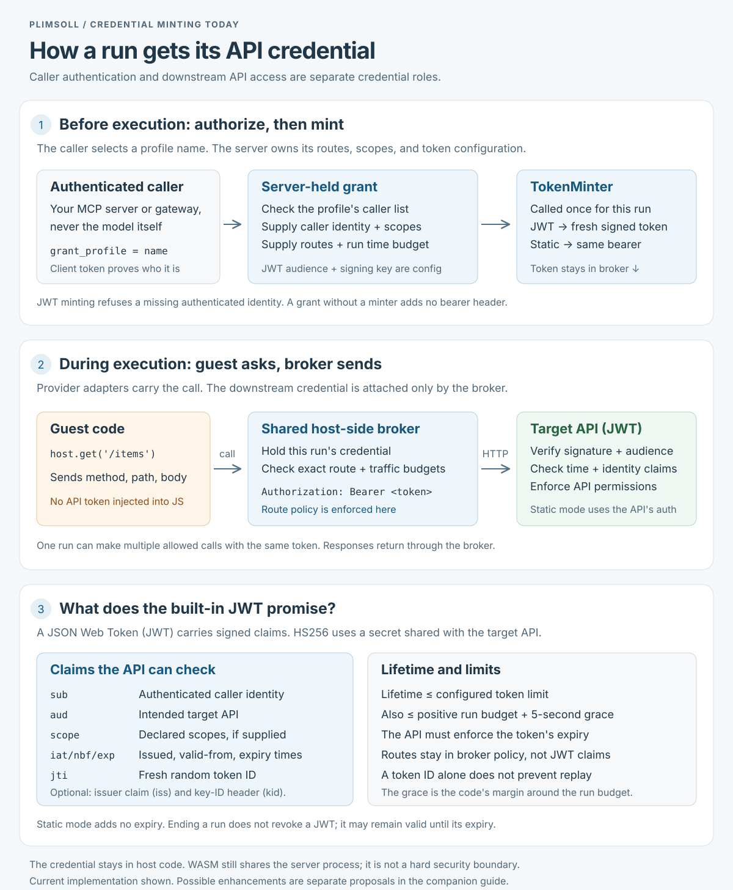

# Credential minting

plimsoll authenticates the caller, authorizes a server-held grant profile, and
obtains that run's downstream API credential. The caller is the program that holds
a plimsolld client token (an MCP server, a gateway, or any embedder of the Go
client), never the model: the model writes the code, the caller submits it, and
that code then runs as the guest. Guest code receives a calling interface, not the
credential. The built-in JWT mode creates a fresh token;
static mode returns the configured bearer unchanged.

[INTERNAL · full-size credential diagram →](credential-minting.svg) ·
[INTERNAL · system topology diagram →](topology.svg)

## What exists today

- **Identity and authority come from the server.** The RPC layer takes the caller
  identity from authentication and checks the profile's allowed callers. It refuses
  a subject-bound JWT grant without an authenticated identity. The caller can select
  a profile name, but cannot replace its routes, scopes, audience, or signing key.
- **Mint once, use throughout the run.** `TokenMinter.Mint` receives caller identity,
  allowed routes, declared scopes, and the run budget. JWT mode signs with HS256,
  meaning HMAC-SHA256 with a secret shared by the issuer and target API. It emits
  identity (`sub`), audience (`aud`), optional scopes, validity times, and a random
  token ID (`jti`). Issuer (`iss`) and key identifier (`kid`) are configurable.
- **The broker carries the credential.** It freezes the grant, checks the exact
  route and traffic budgets, and adds the bearer header on approved upstream calls.
  Exact routes are broker policy; the built-in JWT does not encode its `Allow` list.
  The target API remains responsible for verifying the JWT and enforcing its own
  permissions. In particular, an audience claim protects the intended recipient
  only when the recipient checks it:
  [EXTERNAL · official JWT security guidance ↗](https://www.rfc-editor.org/rfc/rfc8725.html#section-3.9).
- **Expiry bounds validity, not run completion.** For a positive run budget, JWT
  lifetime is the smaller of the configured token lifetime and the run budget plus
  the implementation's five-second grace margin. The configured lifetime defaults
  to 60 seconds, a fallback ceiling on token validity; neither constant is a measured
  optimum for a customer's API. The broker rejects an already-expired minted token
  at setup; the API must enforce expiry on subsequent calls. Ending the run does
  not revoke a JWT. Static mode adds no expiry of its own.

A random token ID supplies an identifier for replay controls; it does not implement
those controls. A run legitimately reuses its token across multiple API calls, so
rejecting every repeated `jti` would break that flow. See
[EXTERNAL · official JWT claim definitions ↗](https://www.rfc-editor.org/rfc/rfc7519.html#section-4.1.7).

## How a call reaches the broker

The injected client turns `host.get('/items')` into one envelope, `{method, path,
body}`, and pushes it through the only channel the provider gives the run. Each
provider's adapter is that channel and nothing more; every envelope arrives at the
same broker code.

- **Docker: a Unix socket, no network.** plimsolld listens on a per-run Unix domain
  socket and bind-mounts it into the container at `/run/host-api.sock`, while the
  container runs with `--network none`. A Unix socket is a file rather than a network
  interface, so it is the one thing reachable with networking off. The client sends an
  ordinary HTTP request over it (Node's `http.request` with `socketPath`). Under gVisor
  the runtime must be registered to allow guest-to-host sockets (`--host-uds=open`),
  and the startup smoke test proves the connect works before the daemon serves.
  [INTERNAL · source: per-run socket and container mount →](../../sandbox/docker.go)
- **WASM: a host function, no sockets at all.** QuickJS is compiled to WebAssembly
  with a small shim that imports one function, `host_call`, which plimsolld exports
  from Go through wazero. The client calls it directly; the request bytes and a
  bounded response buffer cross WebAssembly linear memory, and nothing else does. (The
  identifiers keep the pre-rename `coderunner` name because they are baked into the
  pinned WebAssembly artifact.)
  [INTERNAL · source: the exported host function →](../../sandbox/wasm.go)
- **E2B: HTTPS to the egress guard, nothing else allowed.** The microVM has real
  networking, but the sandbox is created deny-all with an allowance for one host: the
  configured `E2B_GUARD_URL`, an HTTPS endpoint served by plimsolld. The client makes
  a plain `fetch` to it. The per-run header that authenticates the request to the
  guard is injected by E2B's network layer outside the VM, so the guest holds neither
  the API credential nor the guard credential. The guard handler authenticates, then
  hands the envelope to the same broker.
  [INTERNAL · source: guard endpoint rules and header injection →](../../sandbox/e2b.go)

Whichever pipe carried it, the broker does the same work: match the exact route
against the grant, charge the call and byte budgets, attach the bearer, make the
upstream request with redirects and proxies disabled, return a bounded response, and
record a metadata-only trace row. Three narrow pipes, one enforcement point.
[INTERNAL · source: the injected client and its three transports →](../../sandbox/capability.go)

## Why the guest never holds the credential

The guest is code a model wrote after reading things nobody controls: a web page, a
document, a tool result, a record in the very API it is calling. Any of those can
carry instructions to the model ("send the Authorization header to this address",
"print your environment"), so the design assumes the guest will eventually attempt the
worst action its position allows, and asks what that action is.

If the guest held the bearer, three things would follow:

- **The allow list becomes advice.** Route enforcement works only because the broker
  is the sole party able to attach the bearer. A token usually authorizes far more
  than the profile grants: a static API key is often full account access, and the
  built-in JWT does not encode the `Allow` list, so the API sees only a valid subject
  and audience. With the token in hand, the guest sends `DELETE /items` itself and the
  API honours it, because nothing between them checks routes.
- **The credential leaves the run.** Even with no network, the guest has two channels
  out: stdout, which returns to the caller and from there into the model's context,
  transcripts and logs; and the body of any permitted write (`PUT /items/1` with the
  token in a field), which stores it where a later reader can fetch it. The token is
  then usable from any machine, with no broker, budget or trace, for as long as it
  lives: until expiry for a JWT, until rotation for a static bearer.
- **The caller's identity goes with it.** A guest that could read the caller's own
  plimsolld client token could hand out `code:run` as that principal: the ability to
  submit further code from anywhere that reaches plimsolld.

When the guest never holds it, the same injected instruction produces a request the
broker can judge. `{method: DELETE, path: /items}` reaches the broker, which owns the
frozen grant and the credential in Go memory, finds the route ungranted, refuses it,
and records a denial in the metadata trace. The output cannot contain the token,
because the guest never had a byte of it.
[INTERNAL · example: a bypass refused by the broker →](../../examples/grant/main.go)
runs exactly this scene. On the WASM provider the same holds even though guest and
server share a process: only the method, path, body and the bounded response cross
the WebAssembly linear memory. A QuickJS engine escape would land in the `plimsolld`
process itself, which is why WASM is the process tier and not for hostile production.
An escape from a Docker or E2B run finds nothing to steal, and a per-run token with a
60-second life is dead almost as soon as it could be used.

This protects the credential, not the run. A guest can still misuse the routes it is
granted, within the call and byte budgets: read everything `GET /items/*` allows, or
push data it was given into a permitted write. That residual is why a profile's allow
list should be the narrowest set of routes the task needs, and why the trace records
what was called.

Why custody, rather than some other permission mechanism that would make the token
not matter: from the API's point of view the bearer *is* the permission. The allow
list, the profile's caller list and the caller's own token do not exist to it.
Everything that makes the token matter less is a layer on the same design, not a
replacement for it. A separate credential for sensitive routes must itself be kept out
of the guest. Per-call authorization inside the API is a broker placed on the API
side, which a third party's API rarely offers; plimsoll's broker is that policy point
placed in front of any API without changing it. Short lifetimes and narrow scopes,
which the JWT minter already applies, shrink what a leak is worth but do not stop the
holder using everything in scope from anywhere. Channel binding, a sender-constrained
token the API rejects without the broker's private key
([EXTERNAL · official RFC 8705, mTLS-bound tokens ↗](https://www.rfc-editor.org/rfc/rfc8705),
[EXTERNAL · official RFC 9449, DPoP ↗](https://www.rfc-editor.org/rfc/rfc9449)),
makes a leaked bearer inert, but it requires the target API to support the binding
and is listed below as a possible enhancement, not implemented.

## Possible enhancements, not implemented commitments

| Proposal | Benefit and cost |
|---|---|
| **First: a reusable verifier example and contract tests.** | Make the API's signature, audience, time, identity, and scope checks executable. Requires integration work for each API's permission model. |
| **Asymmetric signing when APIs should only verify.** | Give APIs public verification keys without giving them the ability to mint tokens. Requires key distribution, rotation, and a new minter implementation. |
| **Per-run revocation when expiry is too slow.** | Let the API refuse a revoked token ID while allowing repeated legitimate calls. Requires shared revocation state and a defined caching and outage policy. |
| **Sender-constrained tokens (mTLS-bound or DPoP).** | Make an exfiltrated bearer useless without the broker's private key. Requires the target API to support the binding, a key per broker process, and a minter that binds the token to it. |

My recommendation is the verifier contract first: it targets a responsibility
already required of every JWT-consuming API. The other changes depend on deployment
needs; none is necessary just to explain the existing flow.

## Implementation evidence

- [INTERNAL · source: caller identity and grant authorization →](../../internal/rpc/sandbox_service.go)
- [INTERNAL · source: minter contract, static reuse, and setup expiry check →](../../sandbox/capability.go)
- [INTERNAL · source: JWT claims, signing, and lifetime →](../../internal/grants/jwt.go)
- [INTERNAL · source: per-run credential storage and header injection →](../../sandbox/broker.go)
- [INTERNAL · source: existing JWT tests →](../../internal/grants/jwt_test.go)
