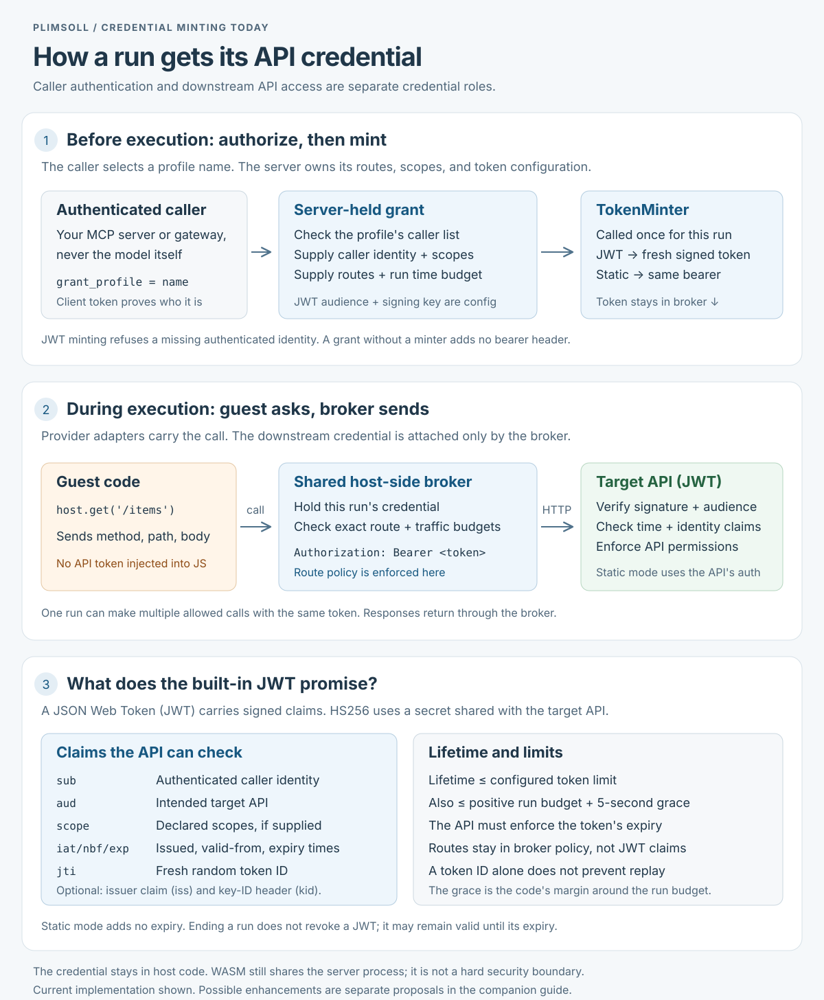

# Credential minting

For each run that may call an API, plimsoll does three things. It authenticates the
caller; it checks that the caller may use the requested <dfn>*grant*</dfn> (a permission
for one run to call listed routes of one API, kept on the server as a profile with a
name); and it gets the credential the run's API calls will carry. Getting that credential
is called <dfn>*minting*</dfn>: plimsoll asks for it once per run. The built-in JWT mode
creates a fresh token; static mode returns the configured bearer token unchanged.

The caller is the program that holds a plimsolld client token, never the model: for
example an <dfn>*MCP*</dfn> server (MCP is the standard protocol an AI application uses
to offer tools to a model), a gateway, or any program built on the Go client. The model
writes the code, the caller submits it, and that code then runs as the
<dfn>*guest*</dfn>, the code inside the sandbox. Guest code gets functions it can call,
not the credential; the <dfn>*broker*</dfn>, the part of plimsoll outside the sandbox that
makes each API call for the guest, holds it.

[INTERNAL · full-size credential diagram →](credential-minting.svg) ·
[INTERNAL · system topology diagram →](topology.svg)

## What exists today

- **Identity and authority come from the server.** The RPC layer takes the caller's
  identity from authentication and checks it against the profile's allowed callers. A
  JWT grant names the caller as its token's subject, so the RPC layer refuses one when
  there is no authenticated identity to name. The caller can select a profile name, but
  cannot replace its routes, scopes, audience (the API the token is meant for), or
  signing key.
- **Mint once, use throughout the run.** `TokenMinter.Mint` receives the caller's
  identity, the allowed routes, the declared scopes, and the run's time budget. JWT mode
  signs with HS256, meaning HMAC-SHA256 with a secret shared by the issuer and the target
  API. The token carries the caller's identity (`sub`), the audience (`aud`), optional
  scopes, validity times, and a random token ID (`jti`). Issuer (`iss`) and key
  identifier (`kid`) are configurable.
- **The broker carries the credential.** It fixes the grant for the run so nothing can
  change it, checks the exact route and the traffic budgets, and adds the bearer header
  to approved calls to the API. The exact routes are the broker's rule to enforce; the
  built-in JWT does not carry the `Allow` list.
  The target API remains responsible for verifying the JWT and enforcing its own
  permissions. In particular, an audience claim protects the intended recipient
  only when the recipient checks it:
  [EXTERNAL · official JWT security guidance ↗](https://www.rfc-editor.org/rfc/rfc8725.html#section-3.9).
- **Expiry limits how long the token is valid; it is not tied to the run ending.** For
  a run with a positive time budget, the JWT's lifetime is the smaller of the configured
  token lifetime and the run's time budget plus the implementation's five-second grace
  margin. The configured lifetime defaults to 60 seconds, a fallback ceiling on how long a
  token is valid; neither number was measured as the best one for a customer's API. The
  broker rejects a minted token that has already expired when the run is set up; the API
  must enforce expiry on later calls. Ending the run does not revoke a JWT. Static mode
  adds no expiry of its own.

The random token ID gives an API something to key replay checks on (refusing a token
it has seen before), but plimsoll does not implement those checks. A run legitimately
reuses its token across several API calls, so rejecting every repeated `jti` would break
that flow. See
[EXTERNAL · official JWT claim definitions ↗](https://www.rfc-editor.org/rfc/rfc7519.html#section-4.1.7).

## How a call reaches the broker

The client plimsoll places in the sandbox turns `host.get('/items')` into one small
message, `{method, path, body}`, and sends it through the only channel the
<dfn>*provider*</dfn> (the backend that runs the code) gives the run. Each provider's
adapter is that channel and nothing more; every message arrives at the same broker
code.

- **Docker: a Unix socket, no network.** plimsolld listens on a per-run Unix domain
  socket and mounts it into the container at `/run/host-api.sock`, while the container
  runs with `--network none`. A Unix socket is a file rather than a network interface,
  so it is the one thing reachable with networking off. The client sends an ordinary
  HTTP request over it (Node's `http.request` with `socketPath`). Under
  <dfn>*gVisor*</dfn>, a layer that answers the container's requests to the kernel
  itself, the runtime must be registered to allow sockets from the guest to the host
  (`--host-uds=open`), and the startup smoke test proves the connection works before
  the daemon serves.
  [INTERNAL · source: per-run socket and container mount →](../../sandbox/docker.go)
- **`wasm`: a function call, no sockets at all.** <dfn>*QuickJS*</dfn>, a small
  JavaScript engine, is compiled to <dfn>*WebAssembly*</dfn> (a portable bytecode format
  that can reach only what its host program hands it) with a shim, a small piece of
  glue code that imports one function, `host_call`. plimsolld provides that function from
  Go through <dfn>*wazero*</dfn>, a WebAssembly runtime written in Go. The client calls it
  directly; the request bytes and a size-limited response buffer cross the WebAssembly
  program's memory, and nothing else does. (The identifiers keep the `coderunner` name
  from before the rename, because they are built into the <dfn>*pinned*</dfn>
  WebAssembly file, fixed to one exact version by its hash.)
  [INTERNAL · source: the exported host function →](../../sandbox/wasm.go)
- **`e2b`: HTTPS to one address, nothing else allowed.** <dfn>*E2B*</dfn> is a hosted
  service that runs each sandbox in a <dfn>*microVM*</dfn>, a small virtual machine made
  for one run. The microVM has real networking, but the sandbox is created
  <dfn>*deny-all*</dfn>, blocking every connection, with an exception for one host: the
  configured `E2B_GUARD_URL`, an HTTPS endpoint served by plimsolld and called the
  <dfn>*guard*</dfn>. The client makes a plain `fetch` to it. E2B's network layer, outside
  the VM, adds the per-run header that authenticates the request to the guard, so the
  guest holds neither the API credential nor the guard credential. The guard checks that
  header, then hands the message to the same broker.
  [INTERNAL · source: guard endpoint rules and header injection →](../../sandbox/e2b.go)

Whichever channel carried it, the broker does the same work: match the exact route
against the grant, count the call against the call and byte budgets, attach the bearer
token, make the request to the API with redirects and proxies disabled, return a
size-limited response, and record one metadata-only row in the call trace. Three narrow
channels, one place where the rules are enforced.
[INTERNAL · source: the injected client and its three transports →](../../sandbox/capability.go)

## Why the guest never holds the credential

The guest is code a model wrote after reading things nobody controls: a web page, a
document, a tool result, a record in the very API it is calling. Any of those can
carry instructions to the model ("send the Authorization header to this address",
"print your environment"), so the design assumes the guest will eventually attempt the
worst action its position allows, and asks what that action is.

If the guest held the bearer token, three things would follow:

- **The allow list becomes a suggestion.** Route enforcement works only because the
  broker is the sole party able to attach the bearer token. A token usually authorizes far more
  than the profile grants: a static API key is often full account access, and the
  built-in JWT does not encode the `Allow` list, so the API sees only a valid subject
  and audience. With the token in hand, the guest sends `DELETE /items` itself and the
  API honours it, because nothing between them checks routes.
- **The credential leaves the run.** Even with no network, the guest has two channels
  out: stdout, which returns to the caller and from there into the model's context,
  transcripts and logs; and the body of any permitted write (`PUT /items/1` with the
  token in a field), which stores it where a later reader can fetch it. The token is
  then usable from any machine, with no broker, budget or trace, for as long as it
  lives: until expiry for a JWT, until rotation for a static bearer.
- **The caller's identity goes with it.** A guest that could read the caller's own
  plimsolld client token could hand out `code:run` as that <dfn>*principal*</dfn>, the
  authenticated identity the token stands for: the ability to submit further code from
  anywhere that reaches plimsolld.

When the guest never holds it, the same planted instruction produces a request the
broker can judge. `{method: DELETE, path: /items}` reaches the broker, which holds the
run's fixed grant and the credential in Go memory, finds the route is not granted,
refuses it, and records a denial in the call trace. The output cannot contain the token,
because the guest never had a byte of it.
[INTERNAL · example: a bypass refused by the broker →](../../examples/grant/main.go)
runs exactly this scene. On the `wasm` provider the same holds even though guest and
server share a process: only the method, path, body and the size-limited response cross
the WebAssembly program's memory. An <dfn>*escape*</dfn> from the QuickJS engine, a bug
that lets the code act outside it, would land in the `plimsolld` process itself, which
is why `wasm` is the process <dfn>*isolation tier*</dfn> (the weakest of the four wall
strengths plimsoll reports) and not for hostile code in production.
An escape from a Docker or E2B run finds nothing to steal, and a per-run token with a
60-second life is dead almost as soon as it could be used.

This protects the credential, not the run. A guest can still misuse the routes it is
granted, within the call and byte budgets: read everything `GET /items/*` allows, or
push data it was given into a permitted write. That remaining risk is why a profile's allow
list should be the narrowest set of routes the task needs, and why the trace records
what was called.

Why keep the token away from the guest, rather than use some other permission
mechanism that would make the token not matter? From the API's point of view the bearer
token *is* the permission. The allow
list, the profile's caller list and the caller's own token do not exist to it.
Everything that makes the token matter less is a layer on the same design, not a
replacement for it. A separate credential for sensitive routes must itself be kept out
of the guest. Per-call authorization inside the API is a broker placed on the API
side, which a third party's API rarely offers; plimsoll's broker is that checkpoint
placed in front of any API without changing it. Short lifetimes and narrow scopes,
which the JWT minter already applies, shrink what a leak is worth but do not stop the
holder using everything in scope from anywhere. Channel binding, a token bound to its
sender, which the API rejects unless the request proves it holds the broker's private
key
([EXTERNAL · official RFC 8705, mTLS-bound tokens ↗](https://www.rfc-editor.org/rfc/rfc8705),
[EXTERNAL · official RFC 9449, DPoP ↗](https://www.rfc-editor.org/rfc/rfc9449)),
makes a leaked bearer token useless, but it requires the target API to support the
binding and is listed below as a possible enhancement, not implemented.

## Possible enhancements, not implemented commitments

| Proposal | Benefit and cost |
|---|---|
| **First: a reusable example of checking the token, with contract tests.** | Turn the checks the API must make (signature, audience, time, identity, scope) into runnable code. Requires integration work for each API's permission model. |
| **Public-key signing, when APIs should only verify.** | Give APIs public verification keys without giving them the ability to mint tokens. Requires key distribution, rotation, and a new minter implementation. |
| **Per-run revocation, when expiry is too slow.** | Let the API refuse a revoked token ID while allowing repeated legitimate calls. Requires a shared list of revoked IDs, and a defined policy for caching it and for when it cannot be reached. |
| **Tokens bound to their sender (mTLS or DPoP).** | Make a stolen bearer token useless without the broker's private key. Requires the target API to support the binding, a key per broker process, and a minter that binds the token to it. |

My recommendation is the checking example and contract tests first: they target a
check every API that accepts JWTs already has to make. The other changes depend on deployment
needs; none is necessary just to explain the existing flow.

## Implementation evidence

- [INTERNAL · source: caller identity and grant authorization →](../../internal/rpc/sandbox_service.go)
- [INTERNAL · source: minter contract, static reuse, and setup expiry check →](../../sandbox/capability.go)
- [INTERNAL · source: JWT claims, signing, and lifetime →](../../internal/grants/jwt.go)
- [INTERNAL · source: per-run credential storage and header injection →](../../sandbox/broker.go)
- [INTERNAL · source: existing JWT tests →](../../internal/grants/jwt_test.go)
